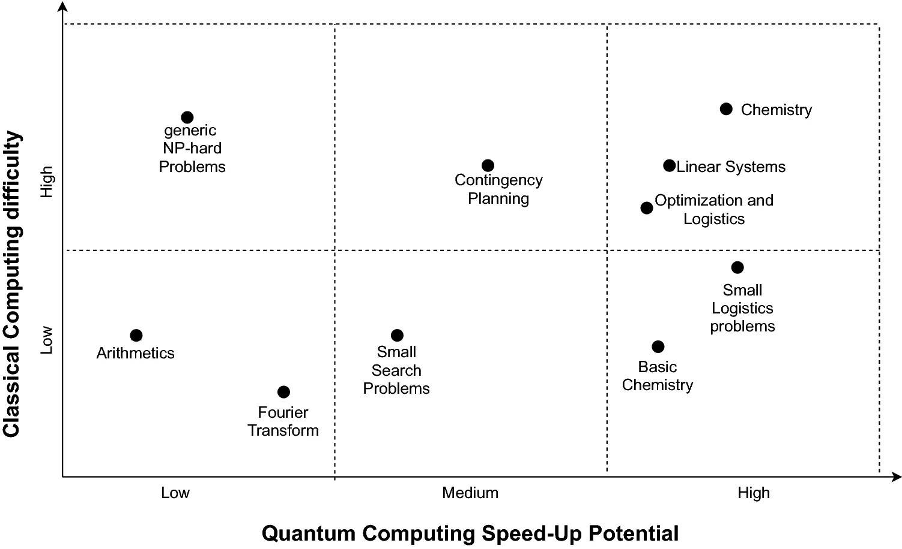

# Applications for Renewable Energy

By 2019, 29 states and DC had “renewable portfolio standards” [[Giani 2021](https://doi.org/10.1007/s42979-021-00786-3)]. The transition, which involves moving away from large, centralized generators to distributed and variable sources like wind and solar means a great deal of restructuring.

Bioenergy is more like a traditional fossil fuel in the contexts described by [[Giani 2021](https://doi.org/10.1007/s42979-021-00786-3)].

The natural processes that provide renewable energy like wind and solar are variable and difficult to predict, which is a challenge for the electrical grid. Some renewable energy also represents a shift from a small number of large, centralized generators to many smaller decentralized generators, rooftop solar in particular. Dispatch of these generators is complex. [[Giani 2021](https://doi.org/10.1007/s42979-021-00786-3)]

<figure>
  
  <figcaption>
    Relative potential for applications of quantum computing.
    [<a href="https://doi.org/10.1007/s42979-021-00786-3">Giani 2021</a>]
  </figcaption>
</figure>

Problems identified as potentially problematic to solve using current computational methods as the number of elements increase and required reaction times decrease in power systems. [[Giani 2021](https://doi.org/10.1007/s42979-021-00786-3)]

Need to compare renewable resources using factors such as price of generated energy, greenhouse gas emissions, availability of resources (such as wind and solar), energy conversion efficiency and social impacts [[Ajagekar 2019](https://doi.org/10.1016/j.energy.2019.04.186)]. Proper allocation requires energy planning models, supply-demand models, renewable energy models, emissions models and optimization models.

Planning and scheduling, location and transportation, resource allocation, engineering design and network planning are areas that may benefit from optimization methods. [[Ajagekar 2019](https://doi.org/10.1016/j.energy.2019.04.186)]

Classical deterministic optimization methods have been used, in addition to heuristic approaches such as simulated annealing (see [quantum annealing](../quantum/architectures/annealing.md)) and genetic algorithms, as well as artificial neural networks (machine learning). [[Ajagekar 2019](https://doi.org/10.1016/j.energy.2019.04.186)]

Current solutions use methods like process integration and superstructure optimization, which are computationally expensive, requiring exponential time with problem size. Futhermore, there is not always a guarantee of a solution. Classical general-purpose optimization methods often are unable to provide feasible solutions for large-scale multi-objective optimization problems, though sometimes specialized methods are available. [[Ajagekar 2019](https://doi.org/10.1016/j.energy.2019.04.186)]

Conflicting objectives, such as use of resources for water vs. food vs. energy. [[Ajagekar 2019](https://doi.org/10.1016/j.energy.2019.04.186)]

Real-world problems may require days or weeks to converge to an optimal solution with a classical optimizer. [[Ajagekar 2019](https://doi.org/10.1016/j.energy.2019.04.186)] Most existing studies are limioted to local and regional scales.