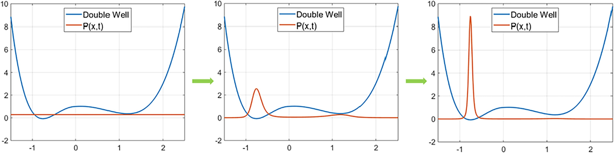

# Quantum Annealer Model

Quantum annealing relies on directly encoding the problem into a quantum energy landscape. [[Giani 2021](https://doi.org/10.1007/s42979-021-00786-3)]

Quantum counterpart of simulated annealing, enables quantum tunneling. [[Ajagekar 2019](https://doi.org/10.1016/j.energy.2019.04.186)]

Quantum annealers are specifically designed for optimization. D-Wave, a Canadian company has made quantum annealers able to solve the [QUBO](../algorithms/qubo.md) algorithm commercially available via the cloud. [[Ajagekar 2019](https://doi.org/10.1016/j.energy.2019.04.186)]

At the beginning of the algorithm, the system is put into a state with a uniform probability distribution. After the annealing process, the system is found in the globally optimum state with high probability. These machines are inherently more robust to environmental noise than [quantum circuit model](circuit.md) machines, but there are very few known problems for which quantum annealers are exponentially faster than classical algorithms. [[Ajagekar 2019](https://doi.org/10.1016/j.energy.2019.04.186)]

<figure>
  
  <figcaption>
    Quantum annealing in a double well potential.
    [<a href="https://doi.org/10.1016/j.energy.2019.04.186">Ajagekar 2019</a>]
  </figcaption>
</figure>
